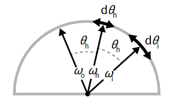
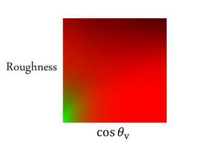
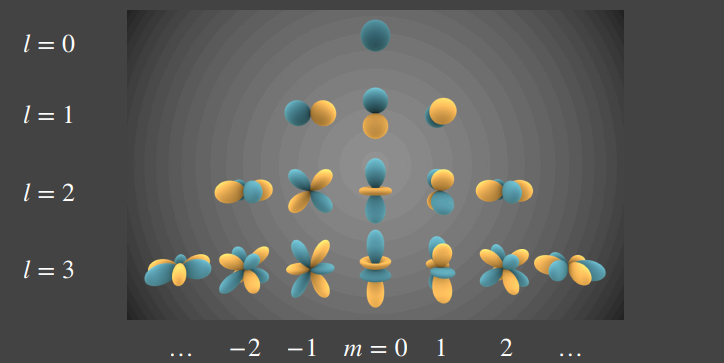
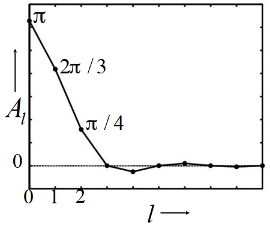
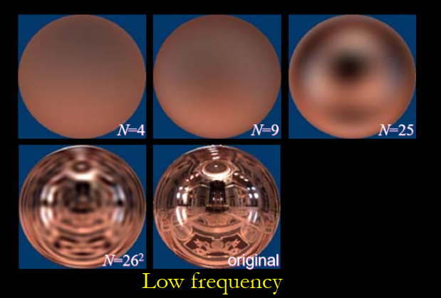
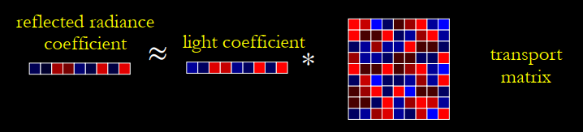

## IBL (Image-Based Lighting)

* 理论基础

  由于是环境光照，不考虑可见性，渲染方程为：
  $$
  L_o(p,\omega_o)=\int_{\Omega^+}L_i(p,\omega_i)f_r(p,\omega_i,\omega_o)\cos\theta_id\omega_i
  $$
  对于glossy的BRDF，它的对应的积分域就很小；对于diffuse的BRDF，它的值就相对smooth，就可以将渲染方程转化为以下的近似：
  $$
  L_o(p,\omega_o) \approx \frac{\int_{\Omega_{f_r}}L_i(p,\omega_i)d\omega_i}{\int_{\Omega_{f_r}}d\omega_i} \cdot \int_{\Omega^+}f_r(p,\omega_i,\omega_o)\cos\theta_id\omega_i
  $$
  因此环境光照可以转化为$\frac{\int_{\Omega_{f_r}}L_i(p,\omega_i)d\omega_i}{\int_{\Omega_{f_r}}d\omega_i}$和$\int_{\Omega^+}f_r(p,\omega_i,\omega_o)\cos\theta_id\omega_i$两项分别计算（Split Sum Approximation）。

* $\frac{\int_{\Omega_{f_r}}L_i(p,\omega_i)d\omega_i}{\int_{\Omega_{f_r}}d\omega_i}$的计算

  * 方法：在预处理阶段，对环境纹理进行Prefiltering。在对环境贴图进行Prefiltering时，要考虑粗糙度，因为随着粗糙度的增加，参与环境贴图Prefiltering的采样向量会更加分散，导致反射更为模糊。所以可以对于Prefiltering的每个粗糙度级别，按顺序将Prefiltering后的结果存储在Prefiltering贴图的Mipmap中。

    

  * 原理：在计算环境光照时，根据BRDF lobe的大小，在BRDF lobe的范围内，对环境光贴图进行采样，计算加权平均后的结果，相当于在镜面反射的方向上，先对环境光贴图上大小相当的区域做加权平均，然后取得平均值计算BRDF。对于漫反射，可以认为其BRDF lobe的中心方向为法线的方向。

    

  * 计算（以[Real Shading in Unreal Engine 4](https://blog.selfshadow.com/publications/s2013-shading-course/karis/s2013_pbs_epic_notes_v2.pdf)为例）：

    由于域$\Omega_{f_r}$的大小与BRDF中的法线分布函数有关，因此在计算时，需要对NDF进行重要性采样。对于GGX NDF：
    $$
    D(\vec{h})=\frac{\alpha^2}{\pi((\alpha^2-1)(\vec{n}\cdot\vec{h})^2+1)^2}
    $$
    
    首先生成若干个二维低差异序列的随机变量$(\xi_{\phi}^i,\xi_{\theta}^i)$，使用采样函数：
    $$
    \begin{align}
    \theta&=\arctan \alpha \sqrt{\frac{\xi_{\theta}}{1-\xi_{\theta}}} \\
    \phi&=2\pi\xi_{\phi}
    \end{align}
    $$
    获得符合GGX概率分布的球坐标系坐标$(\theta,\phi)$，使用该坐标可以计算出对应的微面元半角向量（图中$\omega_h$）。设宏面元的法线方向为光线的反射方向（图中$\omega_o$），就可以根据半角向量计算出光线的入射方向（图中$\omega_i$），然后在环境贴图中进行采样，并计算加权的光照。
    
    
    
    计算加权光照的公式如下（蒙特卡洛估计）：
    $$
    \int\limits_H L_i(\vec{\omega}_i)f(\vec{\omega}_i,\vec{\omega}_o)\cos \theta_{\vec{\omega}_i}d\vec{\omega}_i \approx \frac{1}{N}\sum\limits_{k=1}^{N}\frac{L_i(\vec{\omega}_{ik})f(\vec{\omega}_{ik},\vec{\omega}_{ok})\left|\cos \theta_{\vec{\omega}_{ik}} \right|}{p\left(\vec{\omega}_{ik},\vec{\omega}_o\right)}
    $$
    其中，由于是关于光线入射方向的积分，因此$p\left(\vec{\omega}_{ik},\vec{\omega}_o\right)$应该是关于入射方向$\omega_i$的PDF函数。已有的PDF函数是关于半角向量$\omega_h$的GGX NDF PDF，需要将其转变为关于入射方向$\omega_i$的PDF：
    $$
    p(\vec{\omega}_i)d\vec{\omega}_i = p(\vec{\omega}_h)d\vec{\omega}_h
    $$
    由图可知，有$\theta_i=2\theta_h$（$\theta_i$为$\omega_o$和$\omega_i$之间的角度，因为$\omega_i$是由$\omega_o$和$\omega_h$利用反射方程计算的），$\phi_i=\phi_h$因此有：
    $$
    \begin{align}
    \frac{d\vec{\omega}_h}{d\vec{\omega}_i} &= \frac{\sin \theta_h d\theta_h d\phi_h}{\sin 2\theta_h 2d\theta_hd\phi_h} \\
    &=\frac{\sin \theta_h}{4\cos \theta_h \sin \theta_h} \\
    &=\frac{1}{4\cos \theta_h} \\
    &=\frac{1}{4(\omega_i \cdot \omega_h)}=\frac{1}{4(\omega_o \cdot \omega_h)}
    \end{align}
    $$
    因此有PDF$p(\omega_i)=\frac{D}{4(\omega_o \cdot \omega_h)}$
    
  * 代码：
  
    ```c
    float3 SpecularIBL( float3 SpecularColor , float Roughness, float3 N, float3 V )
    {
        float3 SpecularLighting = 0;
        const uint NumSamples = 1024;
        for( uint i = 0; i < NumSamples; i++ )
        {
            float2 Xi = Hammersley( i, NumSamples );
            float3 H = ImportanceSampleGGX( Xi, Roughness, N );
            float3 L = 2 * dot( V, H ) * H - V;
            float NoV = saturate( dot( N, V ) );
            float NoL = saturate( dot( N, L ) );
            float NoH = saturate( dot( N, H ) );
            float VoH = saturate( dot( V, H ) );
            if( NoL > 0 )
            {
                float3 SampleColor = EnvMap.SampleLevel( EnvMapSampler , L, 0 ).rgb;
                float G = G_Smith( Roughness, NoV, NoL );
                float Fc = pow( 1 - VoH, 5 );
                float3 F = (1 - Fc) * SpecularColor + Fc;
                // Incident light = SampleColor * NoL
                // Microfacet specular = D*G*F*NoH / (4*NoL*NoV)
                // pdf = D / (4 * VoH)
                SpecularLighting += SampleColor * F * G * VoH / (NoH * NoV);
            }
        }
        return SpecularLighting / NumSamples;
    }
    ```
    
    或：
    
    ```c
    float3 PrefilterEnvMap( float Roughness, float3 R )
    {
        float3 N = R;
        float3 V = R;
        float3 PrefilteredColor = 0;
        const uint NumSamples = 1024;
        for( uint i = 0; i < NumSamples; i++ )
        {
            float2 Xi = Hammersley( i, NumSamples );
            float3 H = ImportanceSampleGGX( Xi, Roughness, N );
            float3 L = 2 * dot( V, H ) * H - V;
            float NoL = saturate( dot( N, L ) );
            if( NoL > 0 )
            {
                PrefilteredColor += EnvMap.SampleLevel( EnvMapSampler,L,0 ).rgb * NoL;
                TotalWeight += NoL;
            }
        }
        return PrefilteredColor / TotalWeight;
    }
    ```
    
    或基于积分的PDF和粗糙度，对环境光贴图的Mipmap进行采样：
    
    ```c
    float3 PrefilterEnvMap( float Roughness, float3 R )
    {
    	float3 R = N;
        float3 V = R;
    
        const uint SAMPLE_COUNT = 1024;
        float3 prefilteredColor = 0.0;
        float totalWeight = 0.0;
        
        for(uint i = 0; i < SAMPLE_COUNT; ++i)
        {
            // generates a sample vector that's biased towards the preferred alignment direction (importance sampling).
            float2 Xi = Hammersley(i, SAMPLE_COUNT);
            float3 H = ImportanceSampleGGX(Xi, N, roughness);
            float3 L  = normalize(2.0 * dot(V, H) * H - V);
    
            float NdotL = max(dot(N, L), 0.0);
            if(NdotL > 0.0)
            {
                // sample from the environment's mip level based on roughness/pdf
                float D   = DistributionGGX(N, H, roughness);
                float NdotH = max(dot(N, H), 0.0);
                float HdotV = max(dot(H, V), 0.0);
                float pdf = D * NdotH / (4.0 * HdotV) + 0.0001; 
    
                float resolution = 512.0; // resolution of source cubemap (per face)
                float saTexel  = 4.0 * PI / (6.0 * resolution * resolution);
                float saSample = 1.0 / (float(SAMPLE_COUNT) * pdf + 0.0001);
    
                float mipLevel = roughness == 0.0 ? 0.0 : 0.5 * log2(saSample / saTexel); 
                
                prefilteredColor += EnvMap.SampleLevel(EnvMapSampler, L, mipLevel).rgb * NdotL;
                totalWeight      += NdotL;
            }
        }
    
        prefilteredColor = prefilteredColor / totalWeight;
    }
    ```
    
    
  
* $\int_{\Omega^+}f_r(p,\omega_i,\omega_o)\cos\theta_id\omega_i$的计算

  * 原理：对于BRDF，实际上受到了三个变量的影响：菲涅尔项中的$R_0$，半角$\theta$和粗糙度$\alpha$。因此可以考虑消去较为简单的$R_0$，并对所有可能的$\theta, \alpha$进行预计算，建立查找表。
  $$
    \begin{align}
    \int_{\Omega^+}f_r(p,\omega_i,\omega_o)\cos\theta_id\omega_i &= \int_{\Omega^+}f_r(p,\omega_i,\omega_0)\frac{F(\omega_o,h)}{F(\omega_o,h)}\cos \theta_i d\omega_i \\
    &= \int_{\Omega^+}\frac{f_r(p,\omega_i,\omega_o)}{F(\omega_o,h)}F(\omega_o,h)\cos \theta_i d\omega_i \\
    &= \int_{\Omega^+}\frac{f_r(p,\omega_i,\omega_o)}{F(\omega_o,h)}[R_0+(1-R_0)(1-\cos \theta_i)^5] \cos \theta_i d\omega_i \\
    &=R_0\int_{\Omega^+}\frac{f_r}{F}[1-(1-\cos \theta_i)^5]\cos \theta_i d\omega_i + \int_{\Omega^+}\frac{f_r}{F}(1-\cos \theta_i)^5\cos \theta_i d\omega_i \\
    
    \end{align}
  $$
  
  ​		由此，就可以对所有$\cos \theta_i \in[0,1],\alpha\in[0,1]$，建立二维的查找表，分别计算出对应的$\int_{\Omega^+}\frac{f_r}{F}[1-(1-\cos \theta_i)^5]\cos \theta_i d\omega_i$和$\int_{\Omega^+}\frac{f_r}{F}(1-\cos \theta_i)^5\cos \theta_i d\omega_i$，存入对应位置的RG通道
  
  
  
    * 代码：
  
      ```c
      float2 IntegrateBRDF( float Roughness, float NoV )
      {
          float3 V;
          V.x = sqrt( 1.0f - NoV * NoV ); // sin
          V.y = 0;
          V.z = NoV; // cos
          float A = 0;
          float B = 0;
          const uint NumSamples = 1024;
          for( uint i = 0; i < NumSamples; i++ )
          {
              float2 Xi = Hammersley( i, NumSamples );
              float3 H = ImportanceSampleGGX( Xi, Roughness, N );
              float3 L = 2 * dot( V, H ) * H - V;
              float NoL = saturate( L.z );
              float NoH = saturate( H.z );
              float VoH = saturate( dot( V, H ) );
              if( NoL > 0 )
              {
                  float G = G_Smith( Roughness, NoV, NoL );
                  float G_Vis = G * VoH / (NoH * NoV);
                  float Fc = pow( 1 - VoH, 5 );
                  A += (1 - Fc) * G_Vis;
                  B += Fc * G_Vis;
              }
          }
          return float2( A, B ) / NumSamples;
      }
      ```

## Spherical Harmonics

* 原理

  定义一系列球面上的二维基函数$B_i(\omega)$，其中$l$代表阶，更高的阶数意味着更高的频率。

  

  考虑环境光也是球面上的一个二维函数，就可以用前$n$阶的$n^2$个基函数的线性组合进行表示：$f(x)=\sum\limits_i c_i \cdot B_i(x)$。系数$c_i$表示$f(x)$在对应基函数上的投影：
  $$
  c_i=\int_\Omega f(\omega)B_i(\omega)d\omega
  $$
  对于Diffuse的BRDF，第三阶及之后的系数几乎都$\approx0$，因此可以使用有限阶数的球谐函数计算Diffuse的光照。

  

  球谐函数具有正交性，即：
  $$
  \left\{
  	\begin{array}{**lr**}
  	\int_\Omega B_i(\omega) \cdot B_j(\omega)d\omega = 1, &i=j \\
  	\int_\Omega B_i(\omega) \cdot B_j(\omega)d\omega = 0, &i\neq j
  	\end{array}
  \right.
  $$
  球谐函数旋转后，可以用同阶的基函数的线性组合表示。

* 计算

  * 漫反射

    对于漫反射的物体，其BRDF函数为一个常量，因此它的渲染方程可以写为：
    $$
    L(\omega_o)=\rho \int_\Omega L(\omega_i)V(p,\omega_i)\max(0,\omega_i \cdot n) d\omega_i
    $$
    其中$L(\omega_i)$可以通过预计算，将其用球谐函数展开：
    $$
    L(\omega_i) \approx \sum\limits_{j=1}^{(l^*+1)^2}c_jB_j(\omega_i)
    $$
    

    对渲染方程的另一部分，Light Transport项：$T(\omega_i)=V(p,\omega_i) \max(0,\omega_i \cdot n)$，也可以将其使用球谐函数展开，得到：
    $$
    T(\omega_i)\approx \sum\limits_k c_kB_k(\omega_i)
    $$
    将两项分别代入渲染方程，得到：
    $$
    L(\omega_o) \approx \rho \sum\limits_j \sum\limits_k c_jc_k \int_\Omega B_j(\omega_i)B_k(\omega_i) d\omega_i
    $$
    又因为球谐函数的正交性质，有：
    $$
    L(\omega_i) \approx \rho \sum\limits_p c_{jp}c_{kp}
    $$
    因此对于漫反射的计算，可以通过球谐简化为两个向量的点乘。

  * 高光（Glossy）

    对于高光物体，由于其BRDF是关于入射光和出射光两个向量的函数，因此其Light Transport项是一个四维的函数$T(\omega_i,\omega_o)=f_r(\omega_i,\omega_o)V(\omega_i)\max(0,\omega_i \cdot n)$。对其使用球谐函数进行展开，会得到一个二维的矩阵：
    $$
    T_k(\omega_i,\omega_{ok})=\sum t_{kj}B_j(\omega_i)
    $$
    渲染方程可以写作：
    $$
    L(\omega_o) \approx \sum \left(\sum c_jt_k\right) B_j(\omega_i)
    $$
    

## Appendix

### NDF重要性采样函数的计算

由于NDF有性质：
$$
\int_{\Omega}D(\vec{h})\left|\vec{n}\cdot\vec{h}\right|d\omega_{\vec{h}}=1
$$
因此使用单位立体角，在球面上采样GGX NDF的PDF为（其中$\theta$为方向$\vec{h}$和法线方向$\vec{n}$之间的夹角）：
$$
p_{\vec{h}}(\omega)=\frac{\alpha^2\cos\theta}{\pi((\alpha^2-1)\cos^2\theta+1)^2}=D(\vec{h})\left|\vec{n}\cdot\vec{h}\right|
$$
使用球坐标系的$\theta,\phi$替代上式中的$\omega$，有（$p(\theta,\phi)d\theta d\phi=p(\omega)d\omega, d\omega = \sin\theta d\theta d\phi$）：
$$
p_{\vec{h}}(\theta,\phi)=\frac{\alpha^2\cos\theta\sin\theta}{\pi((\alpha^2-1)\cos^2\theta+1)^2}
$$
可见GGX的PDF与$\phi$没有关系，是各向同性的NDF。有了GGX的PDF后，就可以求出其关于其每个变量的CDF，并使用[逆变换采样](https://en.wikipedia.org/wiki/Inverse_transform_sampling)，利用均匀分布的随机序列生成概率分布符合GGX PDF的随机序列。

对于变量$\phi$，首先计算其对应的边缘累积分布函数$P_{\vec{h}}(\phi)$：
$$
\begin{align}
P_{\vec{h}}(\phi)&=\int_0^{\phi}\int_0^{\frac{\pi}{4}} p_{\vec{h}}(x,y)dx dy \\
&=\int_0^{\phi}\int_0^{\frac{\pi}{4}}\frac{\alpha^2\cos x\sin x dx}{\pi((\alpha^2-1)\cos^2 x+1)^2}dy \\
&=\int_0^{\phi}\int_0^{\frac{\pi}{4}}\frac{-\alpha^2\cos x d\cos x}{\pi((\alpha^2-1)\cos^2 x+1)^2}dy \\
&=\int_0^{\phi}\int_1^0\frac{-\alpha^2udu}{\pi((\alpha^2-1)u^2+1)^2}dy \\
&=\int_0^{\phi}\int_1^0\frac{-\alpha^2d((\alpha^2-1)u^2+1)}{2\pi(\alpha^2-1)((\alpha^2-1)u^2+1)^2}dy \\
&=\int_0^{\phi}\int_{\alpha^2}^1 \frac{-\alpha^2dv}{2\pi(\alpha^2-1)v^2}dy \\
&=\int_0^{\phi}\frac{\alpha^2}{2\pi(\alpha^1-1)}\bigg|_{\alpha^2}^1 dy \\
&=\int_0^{\phi}\frac{1}{2\pi}dy=\frac{\phi}{2\pi}
\end{align}
$$
可得$P^{-1}_{\phi}(\xi_{\phi})=2\pi\xi_{\phi}$

同理，对于变量$\theta$，可以计算对应的边缘累积分布函数$P_{\vec{h}}(\theta)$:
$$
\begin{align}
P_{\vec{h}}(\theta) &= \int_0^{\theta}\int_0^{2\pi} \frac{\alpha^2\cos x\sin x dy}{\pi((\alpha^2-1)\cos^2 x+1)^2}dx \\
& = \int_{0}^{\theta} \dfrac{2\alpha^2 \cos x \sin x}{(\cos^2 x(\alpha^2-1)+1)^2}dx \\ 
& = \int_{\theta}^{0} \dfrac{\alpha^2}{(\cos^2 x(\alpha^2-1)+1)^2}d(\cos^2 x) \\ 
& = \dfrac{\alpha^2}{\alpha^2-1} \int_{0}^{\theta} d{\dfrac{1}{\cos^2 x(\alpha^2-1)+1}}\\ 
& = \dfrac{\alpha^2}{\alpha^2-1} {(\dfrac{1}{cos^2\theta(\alpha^2-1)+1}-\dfrac{1}{\alpha^2})} \\ 
& = \dfrac{\alpha^2}{cos^2\theta(\alpha^2-1)^2+(\alpha^2-1)}-\dfrac{1}{\alpha^2-1}
\end{align}
$$

可得$P_{\theta}^{-1}(\xi_{\theta})=\arccos \sqrt{\frac{1-\xi_{\theta}}{\xi_{\theta}(\alpha^2-1)+1}}=\arctan \alpha \sqrt{\frac{\xi_{\theta}}{1-\xi_{\theta}}}$

因此可生成二维平面内的低差异性序列（Hammersley 序列）随机变量$(\xi_{\phi}^i,\xi_{\theta}^i)$，代入$P^{-1}_{\phi}$和$P_{\theta}^{-1}$得到附和GGX概率分布的球坐标系坐标$(\phi^i,\theta^i)$

```c
float3 ImportanceSampleGGX( float2 Xi, float Roughness, float3 N )
{
    float a = Roughness * Roughness;
    float Phi = 2 * PI * Xi.x;
    float CosTheta = sqrt( (1 - Xi.y) / ( 1 + (a*a - 1) * Xi.y ) );
    float SinTheta = sqrt( 1 - CosTheta * CosTheta );
    float3 H;
    H.x = SinTheta * cos( Phi );
    H.y = SinTheta * sin( Phi );
    H.z = CosTheta;
    float3 UpVector = abs(N.z) < 0.999 ? float3(0,0,1) : float3(1,0,0);
    float3 TangentX = normalize( cross( UpVector, N ) );
    float3 TangentY = cross( N, TangentX );
    // Tangent to world space
    return TangentX * H.x + TangentY * H.y + N * H.z;
}

```

### 逆变换采样（Inverse Transform Sampling）

对于一个概率累积分布函数为$F_X$的连续随机变量$X$，和一个服从区间$[0,1]$上均匀分布的随机变量$Y$，则随机变量$F_X^{-1}(Y)$与$X$有着相同的分布。$x=F_X^{-1}(u)$可以看做是从分布$F_X$中生成的随机样本。

证明：

设$F^{-1}(u)=\inf\{x|F(x)\geq u\}, (0<u<1)$，其中$u$是从$(0,1)$范围内均匀抽取的随机变量。那么$F^{-1}(U)$与$F(x)$相同

对于$F^{-1}(U)$，有：
$$
\begin{align}
&F^{-1}(U) \\
=&P\{F^{-1}(U)\leq x\} \\
=&P\{U \leq F(x)\} \\
=&F(x)
\end{align}
$$


