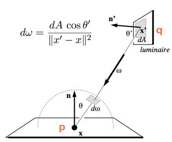
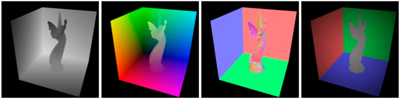
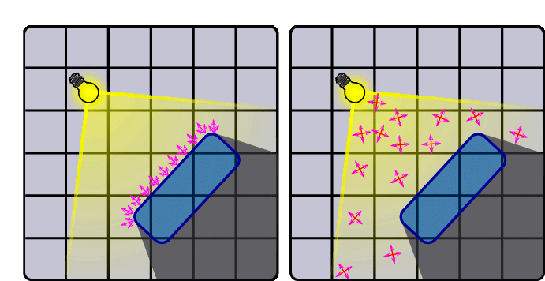
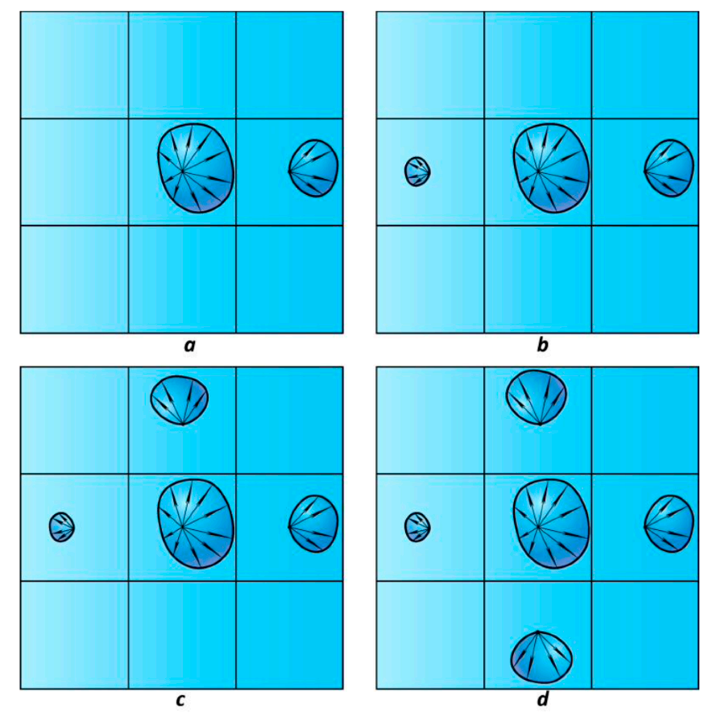
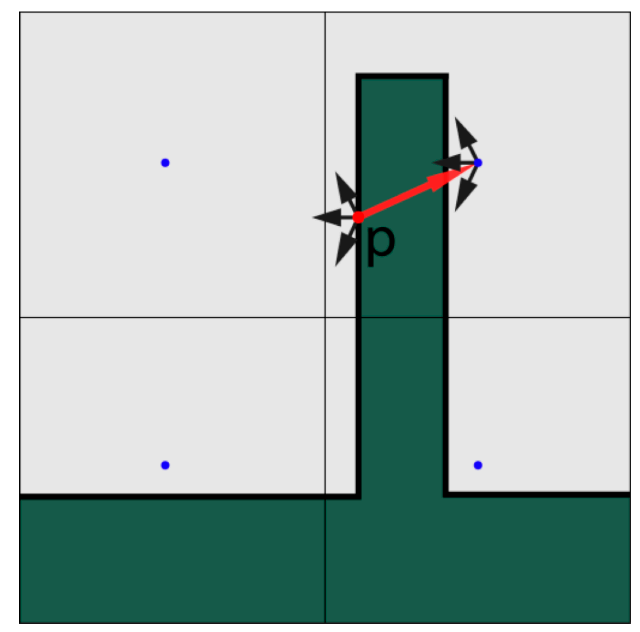
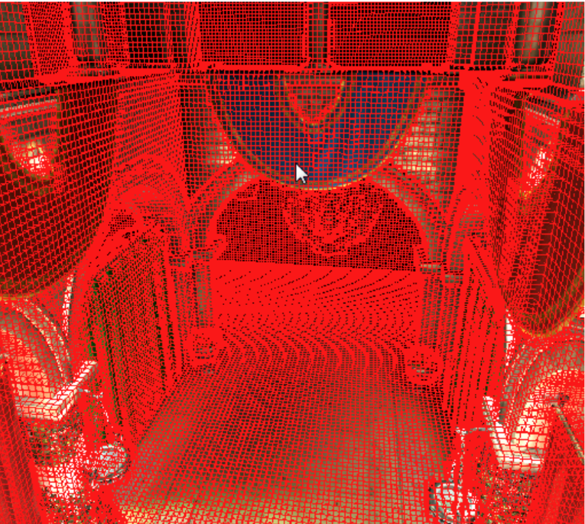
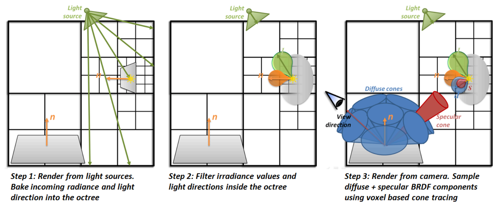
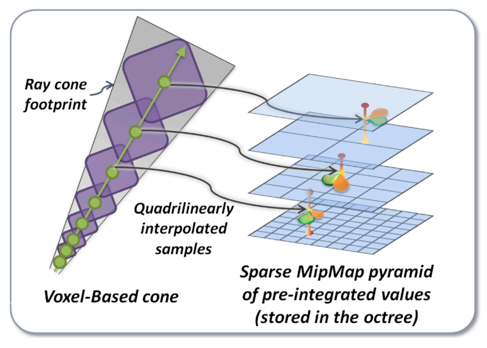
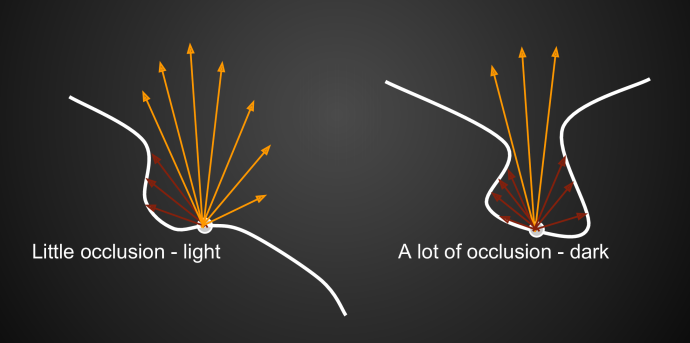
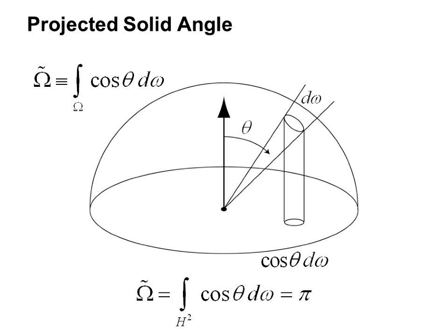

# Global Illumination

## Global Illumination需要解决的问题

1. 场景中，哪些表面被直接照亮。

2. 对于场景中的一点$p$，计算场景中其他表面对其的光照贡献总和。

## Reflective Shadow Maps (RSM)

* 理论基础

  对于问题1，使用shadow map确定被光源照亮的表面，并假设这些表面均以漫反射的形式向外反射光线。

  对于问题2，对点$p$求积分

  

  由于假设了面$q$的漫反射，因此有：(其中$\Phi$为incident flux or energy)
  $$
  L_i(p,\omega_o) = f_r \cdot \frac{\Phi}{dA} \\
  f_r= \frac{\rho}{\pi}
  $$
  点$p,q$之间的可见性函数$V$难以计算，因此假设为$1$

  可得：
  $$
  \begin{align}
  L_o(p,\omega_o) &= \int_{A_{patch}}L_i(q \rightarrow p)V(p, \omega_i)f_r(p,q \rightarrow p, \omega_o)\frac{\cos \theta_p \cos \theta_q}{||q-p||^2} \mathrm dA \\
  &= \sum_q \frac{\rho \Phi_q}{\pi} \frac{\max(0, \cos \theta_p)\max (0, \cos \theta_q)}{||q-p||^2}
  \end{align}
  $$

* RSM加速

  由于距离较远的点的光照贡献较小，因此可以只计算点$p$周围的点的光照贡献得到近似结果。可以通过将点$p$投影到shadow map上，并对周围进行采样计算来实现（参照PCSS）

* RSM需要记录到纹理的数据：深度，世界坐标，法线，flux

  

* 优点
  - 容易实现

* 缺点
  * 性能随光源的个数，影响范围的增大线性增长
  * 对于间接光照，没有计算可见性
  * 假设过多：漫反射，距离衰减假设...

## Light Propagation Volumes (LPV)

* 基本思路

  假设radiance在传播过程中不变，那么可以将场景划分为3D的网格，以网格为单位记录次级光源反射的radiance的传播信息，从而在渲染时直接查询得到周围所有次级光源的入射能量总和。

* 具体步骤

  * Step 1: Generation

    确定场景的哪些面会作为次级光源向外反射间接光。可以使用RSM中的方法来实现。 

  * Step 2: Injection

    计算每个格子内，次级光源出射方向的分布，使用前两阶的SH进行描述，并记录在格子内。

    

  * Step 3: Propagation

    对于每个格子，计算其周围6个格子接收到的radiance，模拟光线的传播。迭代这个过程4~5次。

    

  * Step 4: Rendering

    对于任意的shading point，找到它所在的格子，使用格子内的入射radiance信息计算间接光照

* 缺点

  受限于空间划分的粒度，会出现light leaking的问题。如图中$p$点处的次级光源会照亮它的背面。

  

## Voxel Global Illumination (VXGI)

* 基本思路

  将场景转化为体素的形式，记录每个体素内的光照，材质，表面等信息，在渲染时通过cone tracing的形式在体素中查询相应的信息。

  

* 具体步骤

  

  * Pass 1: from the light

    从光源方向渲染场景，记录每个体素内的入射光信息以及表面的法线分布，并更新体素的层级结构

  * Pass 2: from the camera

    从相机方向渲染场景，根据物体表面的材质类型（diffuse或者glossy），从BRDF的分布方向对体素进行查询，即cone tracing：对于glossy的材质，BRDF分布在一个锥体上，找到与这个锥体相交的体素，利用体素内的信息计算光照；对于diffuse的材质，BRDF的分布可以看做多个锥体的结合。

    查询时，由于锥体的大小逐渐变大，相应的体素查询也可以在更的高层级处进行。

  

## Screen Space Ambient Occlusion (SSAO)

* 理论基础

  对于环境光照，假设其对于各个shading point，从各个方向入射的radiance大小是相同的，但是有着不同的可见性。并且均为diffuse材质。

  

  那么对于渲染方程，就可以使用近似$\int_\Omega f(x)g(x) \mathrm dx \approx \frac{\int_{\Omega_G}f(x) \mathrm dx }{\int_{\Omega_G} \mathrm dx} \cdot \int_G g(x) \mathrm dx$对渲染方程进行简化（其中，由于之前的假设，BRDF为$\frac{\rho}{\pi}$，$L_i(p)$为常数）：
  $$
  \begin{align}
  L_o(p, \omega_o) &= \int_{\Omega^+}L_i(p,\omega_i)f_r(p,\omega_i,\omega_o)V(p,\omega_i)\cos \theta_i \mathrm d\omega_i \\
  &\approx \frac{\int_{\Omega^+}V(p,\omega_i)\cos \theta_i \mathrm d\omega_i}{\int_{\Omega^+} \cos \theta_i \mathrm d\omega_i} \cdot \int_{\Omega^+}L_i(p,\omega_i)f_r(p,\omega_i,\omega_o)\cos \theta_i
   \mathrm d\omega_i \\
   &= \frac{\int_{\Omega^+} V(p,\omega_i) \cos \theta_i \mathrm d\omega_i}{\pi} \cdot L_i(p) \cdot \frac{\rho}{\pi} \cdot \pi \\
   &= \frac{\rho}{\pi} \cdot L_i(p) \cdot \int_{\Omega^+} V(p,\omega_i) \cos \theta_i \mathrm d\omega_i
  \end{align}
  $$
  * 补充*

    上式中的$\cos \theta_i \mathrm d\omega_i$可以看做一个独立的微元$\mathrm dx_\perp$，为单位立体角在水平面上的投影

    

